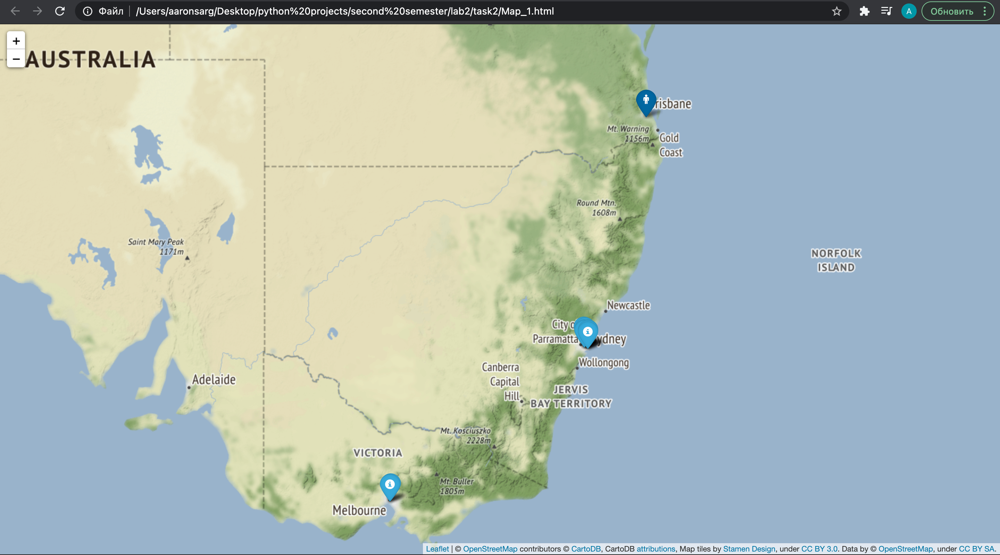

# Film Map
Film map is a Python package for finding nearbyl ocations where movies were recorded.

## If you visit some country and you don't know places to visit, you can find some with this package.

## Installation

Download main.py and filtered_data.csv to open this file. Also, check requirements.txt to isntall all libraries.

## Usage

Open main.py and enter year and coordiantes.

## Example

```bash
Type the year: 1989
Type the latitude: -27.6116318
Type the longitude: 153.0656715
Check Map_1.html
```



## Contributing
Pull requests are welcome. For major changes, please open an issue first to discuss what you would like to change.

Please make sure to update tests as appropriate.

## License
[MIT](https://choosealicense.com/licenses/mit/)